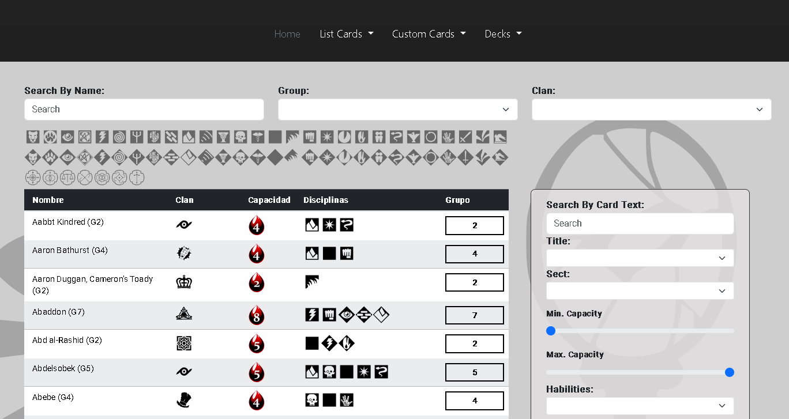

# 👋 ¡Hola! Soy Carlos

### 👨‍💻 Sobre mí
¡Hola! Soy Carlos, un desarrollador apasionado por la creación de aplicaciones web y móviles con soluciones eficientes e innovadoras. Me encanta aprender tecnologías nuevas y trabajar en equipo para construir proyectos que marquen la diferencia.

---

### 🧑‍💻 Actualmente
- 🌱 Estoy estudiando: Desarrollo de Aplicaciones Multiplataformas (DAM).
- 💼 Trabajo en: Proyectos personales y desarrollo de habilidades.
- 🎯 Intereses: Desarrollo web, móvil e inteligencia artificial, Cine y Lectura (Expecialmente la novela fantastica).

---

### 📅 Mi viaje como desarrollador
- **2021:** Comencé mis estudios en Desarrollo de Aplicaciones Web.
- **2024:** Me matricule en Desarrollo de Aplicaciones Multiplataforma para ampliar mis conocimientos.
- **2025:** Planifico contribuir a proyectos de código abierto y mejorar mi portafolio profesional.

---

### 🌟 Mis proyectos destacados
1. **[Parte Front de mi proyecto final en DAW](https://front-vtes.vercel.app/)**  
   Una aplicación para gestionar la creacion de mazos, torneos y cartas pesonalizadas, construida con Angular y Node.  
   
   
2. **[Sitio de Recetas](https://github.com/tuusuario/recetas-app)**  
   Una plataforma para compartir recetas, desarrollada con Angular y Firestore.  
   

---

### 🛠️ Tecnologías y herramientas

  
  
  
  
  
  

---

### 🌐 Conéctate conmigo
- 📧 [dominguezalacid@gmail.com](mailto:dominguezalacid@gmail.com)
- 💼 [LinkedIn](https://www.linkedin.com/in/carlos-fernandez-gonzalez-a1025b263/)

---

### ✨ Mis valores y objetivos
- 🚀 Innovar con cada proyecto que creo.
- 🤝 Fomentar el aprendizaje colaborativo.
- 🌱 Aprender constantemente para estar al día con las últimas tecnologías.

---

### 🌟 Estadísticas de GitHub

---

### 🌟 Lo que dicen sobre mí
> *"Carlos tiene un enfoque innovador y resuelve problemas de forma eficaz."*  
> – Juan Pérez, colega de equipo

---

### 🤝 ¿Colaboramos?
Estoy buscando contribuir a proyectos interesantes y colaborar con otros desarrolladores. Si tienes alguna idea o proyecto, ¡escríbeme!  
📧 dominguezalacid@gmail.com
